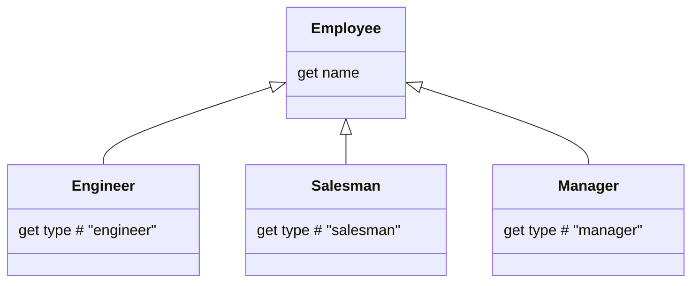
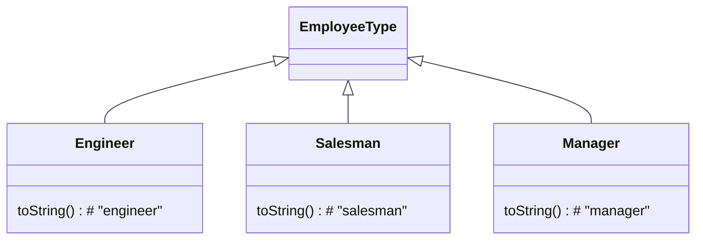

[](https://github.com/kaiosilveira/replace-type-code-with-subclasses-refactoring/actions/workflows/ci.yml)

ℹ️ _This repository is part of my Refactoring catalog based on Fowler's book with the same title. Please see [kaiosilveira/refactoring](https://github.com/kaiosilveira/refactoring) for more details._

---

# Replace Type Code With Subclasses

**Subsumes: Replace Type Code with State / Strategy**
**Subsumes: Extract Subclass**

<table>
<thead>
<th>Before</th>
<th>After</th>
</thead>
<tbody>
<tr>
<td>

```javascript
function createEmployee(name, type) {
  return new Employee(name, type);
}
```

</td>

<td>

```javascript
function createEmployee(name, type) {
  switch (type) {
    case 'engineer':
      return new Engineer(name);
    case 'salesman':
      return new Salesman(name);
    case 'manager':
      return new Manager(name);
  }
}
```

</td>
</tr>
</tbody>
</table>

**Inverse of: [Remove Subclass](https://github.com/kaiosilveira/remove-subclass-refactoring)**

Many class hierarchies fall short from their idiomacy (is that a word?) and intended goal of abstracting away details at the moment they start including hints to the client code regarding what will happen. This is specially true when you have enum-like flags passed around during construction. This refactoring helps bringing abstraction back to its best.

### Example: subclassing by employee type

Our first working example is a program that contains a base `Employee` class, that receives a `type` when it's constructed. To introduce a degree of polymorphism, therefore allowing for more flexible, particular behaviors in the future, we want to introduce a series of subclasses of `Employee`, creating the following class hierarchy:



#### Test suite

The starting test suite for this example covers the basic behavior of `Employee`, but receives considerable expansion as we go. Please check the source code directly for details.

#### Steps

We start by exposing the `type` field as a getter at `Employee`. This will serve as a basis for overriding behavior in the subclasses:

```diff
export class Employee {
+  get type() {
+    return this._type;
+  }
```

Then, we update `Employee.toString` to use the `type` getter instead of private field:

```diff
export class Employee {
   toString() {
-    return `${this._name} (${this._type})`;
+    return `${this._name} (${this.type})`;
   }
```

And now we can start introducing the subclasses. We start with `Engineer`:

```diff
+export class Engineer extends Employee {
+  constructor(name) {
+    super(name, `engineer`);
+  }
+
+  get type() {
+    return `engineer`;
+  }
+}
```

From this moment onwards, we need a way to return a subclass based on the `type` argument. This logic would make the constructor a bit messy, so we introduce a `createEmployee` factory function:

```diff
+export const createEmployee = (name, type) => {
+  return new Employee(name, type);
+};
```

We, then, start returning an `Engineer` subclass when the `type` is `engineer`:

```diff
 export const createEmployee = (name, type) => {
+  switch (type) {
+    case 'engineer':
+      return new Engineer(name);
+  }
   return new Employee(name, type);
 };
```

And now we can generalize the case. We do the same steps for `Salesman`, first creating it:

```diff
+export class Salesman extends Employee {
+  constructor(name) {
+    super(name, `salesman`);
+  }
+
+  get type() {
+    return `salesman`;
+  }
+}
```

and then returning it:

```diff
 export const createEmployee = (name, type) => {
   switch (type) {
     case 'engineer':
       return new Engineer(name);
+    case 'salesman':
+      return new Salesman(name);
   }
   return new Employee(name, type);
 };
```

And then for `Manager`. Creating it first:

```diff

+export class Manager extends Employee {
+  constructor(name) {
+    super(name, `manager`);
+  }
+
+  get type() {
+    return `manager`;
+  }
+}
```

and then returning it at `createEmployee`:

```diff
export const createEmployee = (name, type) => {
  switch (type) {
     case 'engineer':
       return new Engineer(name);
     case 'salesman':
       return new Salesman(name);
+    case 'manager':
+      return new Manager(name);
   }
   return new Employee(name, type);
}
```

Finally, since all subclasses already have their `type` getters well defined, we can remove this getter from the base `Employee` superclass:

```diff
export class Employee {
   constructor(name, type) {
     this.validateType(type);
     this._name = name;
-    this._type = type;
-  }
-
-  get type() {
-    return this._type;
   }
```

We can also get rid of the type validation at the superclass level, since it's now handled by the `createEmployee` factory function:

```diff
 export class Employee {
   constructor(name, type) {
-    this.validateType(type);
     this._name = name;
   }
-  validateType(arg) {
-    if (![`engineer`, `manager`, `salesman`].includes(arg))
-      throw new Error(`Employee cannot be of type ${arg}`);
-  }
```

And since we want to preserve the "invalid type" guard clause, we implement it at `createEmployee` (please note that we first removed the validation and then reintroduced it somewhere else, which for real-life scenarios would be a mistake and would have to happen in the reverse other instead):

```diff
export const createEmployee = (name, type) => {
    switch (type) {
     case 'engineer':
       return new Engineer(name);
     case 'salesman':
       return new Salesman(name);
     case 'manager':
       return new Manager(name);
+    default:
+      throw new Error(`Employee cannot be of type ${type}`);
   }
-  return new Employee(name, type);
 };
```

Last, but not least, we can remove the `type` argument altogether from the base `Employee` superclass and all subclasses:

```diff
diff --git Employee...
 export class Employee {
-  constructor(name, type) {
+  constructor(name) {
     this._name = name;
   }

diff --git Engineer...
 export class Engineer extends Employee {
   constructor(name) {
-    super(name, `engineer`);
+    super(name);
   }

diff --git Manager...
 export class Manager extends Employee {
   constructor(name) {
-    super(name, `manager`);
+    super(name);
   }

diff --git Salesman...
 export class Salesman extends Employee {
   constructor(name) {
-    super(name, `salesman`);
+    super(name);
   }
```

And that's it!

#### Commit history

Below there's the commit history for the steps detailed above.

| Commit SHA                                                                                                                               | Message                                                                  |
| ---------------------------------------------------------------------------------------------------------------------------------------- | ------------------------------------------------------------------------ |
| [2dd4c4e](https://github.com/kaiosilveira/replace-type-code-with-subclasses-refactoring/commit/2dd4c4e875f8f6bfb5732b4dc957176c508d205d) | expose `type` field as a getter at `Employee`                            |
| [1e641f6](https://github.com/kaiosilveira/replace-type-code-with-subclasses-refactoring/commit/1e641f6135b62547ee9892ba32074b0e19cd8dd7) | update `Employee.toString` to use `type` getter instead of private field |
| [33bf59f](https://github.com/kaiosilveira/replace-type-code-with-subclasses-refactoring/commit/33bf59f586df6db4356f1fb785fcc8205dd768f0) | introduce `Engineer` subclass                                            |
| [2b6627d](https://github.com/kaiosilveira/replace-type-code-with-subclasses-refactoring/commit/2b6627db1d016ccb7bd95cafe6d255bbf1fbd0d6) | introduce `createEmployee` factory function                              |
| [798421f](https://github.com/kaiosilveira/replace-type-code-with-subclasses-refactoring/commit/798421fb74bb9d6c5aecc9dbfa769d34ef972efc) | return `Engineer` subclass when `type` is `engineer` at `createEmployee` |
| [593bf84](https://github.com/kaiosilveira/replace-type-code-with-subclasses-refactoring/commit/593bf844a95d8a32a2283a928bb214382e2800b0) | introduce `Salesman` subclass                                            |
| [1e74c99](https://github.com/kaiosilveira/replace-type-code-with-subclasses-refactoring/commit/1e74c99d0f447b7e04a0d0df9cc8aca267468eea) | return `Salesman` subclass when `type` is `salesman` at `createEmployee` |
| [963371d](https://github.com/kaiosilveira/replace-type-code-with-subclasses-refactoring/commit/963371d961fd17da7aa8a791d8f28d11eb823844) | introduce `Manager` subclass                                             |
| [c3fecd9](https://github.com/kaiosilveira/replace-type-code-with-subclasses-refactoring/commit/c3fecd9906776abf0b6cddae593dbaf9da1433c3) | return `Manager` subclass when `type` is `manager` at `createEmployee`   |
| [9b13d25](https://github.com/kaiosilveira/replace-type-code-with-subclasses-refactoring/commit/9b13d25656bff671b6f68d0e37dd921bc97e2e75) | remove `type` getter from base `Employee` superclass                     |
| [f2cbc5e](https://github.com/kaiosilveira/replace-type-code-with-subclasses-refactoring/commit/f2cbc5e6c79a633310a8867adb1ae6ad5e78c5b8) | remove type validation at base `Employee` superclass                     |
| [1765d29](https://github.com/kaiosilveira/replace-type-code-with-subclasses-refactoring/commit/1765d299d85db3baeeec8c9043ddd6c66dda1a12) | throw error if employee type is invalid at `createEmployee`              |
| [813c8c3](https://github.com/kaiosilveira/replace-type-code-with-subclasses-refactoring/commit/813c8c3f0448eb561a33885edd0e132f9b796bb8) | remove `type` argument from base `Employee` superclass                   |

For the full commit history for this project, check the [Commit History tab](https://github.com/kaiosilveira/replace-type-code-with-subclasses-refactoring/commits/main).

### Example: Using indirect inheritance

This example is similar to the first one, but our approach here is different: instead of subclassing `Employee`, we're going to do it only for `type`. This allows for the same flexible, particular behaviors mentioned before, but only for the portion that touches the `type` aspect of employees. The target class hierarchy is:



#### Test suite

The starting test suite for this example covers the basic behavior of `Employee`, but receives considerable expansion as we go. Please check the source code directly for details.

#### Steps

We start by introducing the `EmployeeType` superclass:

```diff
+export class EmployeeType {
+  constructor(value) {
+    this.value = value;
+  }
+
+  toString() {
+    return this.value;
+  }
+}
```

Now, since we want to continue using the `Employee.type` class the same way as before, we need to update the inner workings of `Employee` so it contains a string representation of `type`:

```diff
class Employee {
+  get typeString() {
+    return this._type.toString();
+  }
+
   get capitalizedType() {
-    return this._type.charAt(0).toUpperCase() + this._type.substr(1).toLowerCase();
+    return this.typeString.charAt(0).toUpperCase() + this.typeString.substr(1).toLowerCase();
   }
```

We need to do the same for the input of `validateType` in the constructor:

```diff
class Employee {
   constructor(name, type) {
-    this.validateType(type);
+    this.validateType(type.toString());
     this._name = name;
     this._type = type;
   }
```

And now we're ready to start the subclassing work, which is pretty much identical to what we did in the previous example. We start by introducing a `createEmployeeType` factory function:

```diff
+function createEmployeeType(value) {
+  if (!['engineer', 'manager', 'sales'].includes(value)) {
+    throw new Error(`Employee cannot be of type ${value}`);
+  }
+
+  return new EmployeeType(value);
+}
```

Then we start introducing the subclasses. We start with `Engineer`:

```diff
+export class Engineer extends EmployeeType {
+  toString() {
+    return 'engineer';
+  }
+}
```

and start returning it it at `createEmployeeType`:

```diff
function createEmployeeType(value) {
+  switch (value) {
+    case 'engineer':
+      return new Engineer();
+  }
 }
```

Then `Manager`:

```diff
+export class Manager extends EmployeeType {
+  toString() {
+    return 'manager';
+  }
+}
```

and start returning it:

```diff
function createEmployeeType(value) {
   switch (value) {
     case 'engineer':
       return new Engineer();
+    case 'manager':
+      return new Manager();
   }
```

And, finally, `Salesman`:

```diff
+export class Salesman extends EmployeeType {
+  toString() {
+    return 'salesman';
+  }
+}
```

and start returning it:

```diff
function createEmployeeType(value) {
       return new Engineer();
     case 'manager':
       return new Manager();
+    case 'sales':
+      return new Salesman();
   }
```

Now on to bit embellishments, we move the type validation to the `default` clause of the switch statement:

```diff
function createEmployeeType(value) {
-  if (!['engineer', 'manager', 'sales'].includes(value)) {
-    throw new Error(`Employee cannot be of type ${value}`);
-  }
-
   switch (value) {
     case 'engineer':
       return new Engineer();
     case 'manager':
       return new Manager();
     case 'sales':
       return new Salesman();
+    default:
+      throw new Error(`Employee cannot be of type ${value}`);
   }

   return new EmployeeType(value);
```

And then safely remove the now unreacheable base `EmployeeType` instantiation:

```diff
function createEmployeeType(value) {
     default:
       throw new Error(`Employee cannot be of type ${value}`);
   }
-
-  return new EmployeeType(value);
 }
```

Now, with the class hierarchy in place, we can start adding behavior to it. An example is the capitalization logic, which can be moved to `EmployeeType`:

```diff
class EmployeeType {
+  get capitalizedName() {
+    return this.toString().charAt(0).toUpperCase() + this.toString().slice(1);
+  }
```

relieving `Employee` from this burden:

```diff
class Employee {
-  get capitalizedType() {
-    return this.typeString.charAt(0).toUpperCase() + this.typeString.substr(1).toLowerCase();
-  }

   toString() {
-    return `${this._name} (${this.capitalizedType})`;
+    return `${this._name} (${this.type.capitalizedName})`;
   }
 }
```

And that's all for this one!

#### Commit history

Below there's the commit history for the steps detailed above.

| Commit SHA                                                                                                                               | Message                                                                           |
| ---------------------------------------------------------------------------------------------------------------------------------------- | --------------------------------------------------------------------------------- |
| [de31941](https://github.com/kaiosilveira/replace-type-code-with-subclasses-refactoring/commit/de319411806a00a8cde619f254c83250cde10252) | introduce `EmployeeType`                                                          |
| [62b6af4](https://github.com/kaiosilveira/replace-type-code-with-subclasses-refactoring/commit/62b6af4ba7ddd1a649c7911950f9a43da8e56e71) | update `Employee.capizaliedType` to use `typeString` instead of `type`            |
| [57d116c](https://github.com/kaiosilveira/replace-type-code-with-subclasses-refactoring/commit/57d116c9f66fdd2b902287379d381a57b0ed1085) | prepare `Employee` to reveive `type` as an object                                 |
| [55970e0](https://github.com/kaiosilveira/replace-type-code-with-subclasses-refactoring/commit/55970e09e4cbed7afb48642341b3152ff99099da) | introduce `createEmployeeType` factory function                                   |
| [26f75ff](https://github.com/kaiosilveira/replace-type-code-with-subclasses-refactoring/commit/26f75fffa566c15371fcb3ad2590852c5a78f34e) | introduce `Engineer` subclass                                                     |
| [2334142](https://github.com/kaiosilveira/replace-type-code-with-subclasses-refactoring/commit/233414269580b12fff1d422317a0d6932ca276d0) | return instance of `Engineer` if `type` is 'engineer' at `createEmployeeType`     |
| [ca572e8](https://github.com/kaiosilveira/replace-type-code-with-subclasses-refactoring/commit/ca572e87f9b8f0811cc03261f07126d31218572d) | introduce `Manager` subclass                                                      |
| [390aae7](https://github.com/kaiosilveira/replace-type-code-with-subclasses-refactoring/commit/390aae748548009ac5c5f14236f58a96746a5d49) | return instance of `Manager` if `type` is 'manager' at `createEmployeeType`       |
| [94a771c](https://github.com/kaiosilveira/replace-type-code-with-subclasses-refactoring/commit/94a771cef62c3249c1b1eb1b62b3520005f2f206) | introduce `Salesman` subclass                                                     |
| [e23e4ae](https://github.com/kaiosilveira/replace-type-code-with-subclasses-refactoring/commit/e23e4ae9974b08e87862f7b7ba79c811968cd707) | return instance of `Salesman` if `type` is 'sales' at `createEmployeeType`        |
| [ef7644e](https://github.com/kaiosilveira/replace-type-code-with-subclasses-refactoring/commit/ef7644edefcfaa92b70795384f6ad4a037da3f7c) | throw erorr if employee type is invalid at `createEmployeeType`                   |
| [5f509a5](https://github.com/kaiosilveira/replace-type-code-with-subclasses-refactoring/commit/5f509a52c9c86e19e65dc65157380114b1077b1c) | remove now unreacheable base `EmployeeType` instantiation at `createEmployeeType` |
| [726f5b7](https://github.com/kaiosilveira/replace-type-code-with-subclasses-refactoring/commit/726f5b733a697474994ac8693ddd4bbcb59cd773) | add capitalization logic to `EmployeeType`                                        |
| [573c355](https://github.com/kaiosilveira/replace-type-code-with-subclasses-refactoring/commit/573c35576f88c54d2adb9617770564491cccfe37) | update `Employee` to use delegated capitalized type                               |

For the full commit history for this project, check the [Commit History tab](https://github.com/kaiosilveira/replace-type-code-with-subclasses-refactoring/commits/main).
